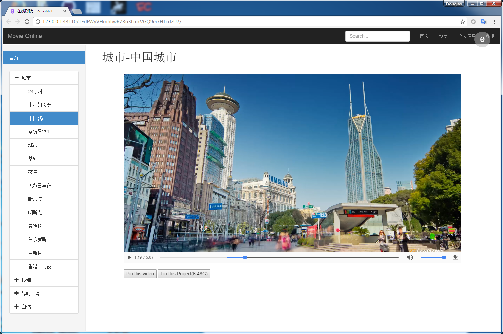

# IPFS_MovieOnline

本项目是ZeroNet上的一个视频网站，未来预期加入弹幕以及自主提交视频hash等功能：）欢迎大家Pull Request。

目前最需要解决的：

1. zeronet的API调用

2. 发送弹幕数据存储

3. 界面UI美化（或者直接换模板）

4. 用户表以及板块设计

   ​

   以上工程都需要大量时间和精力，恕我个人多事在身无法完成这个项目，望@p2p 、@猫叉酱、@莱文倩、@Lmath 以及其他各位ZN上的开发爱好者共同参与这个项目，目前这个模板完全是按照静态网站思路写的，包括上传文件和做种只花了我一个下午和一个晚上的时间，可见也不难^_^希望大家再接再厉

